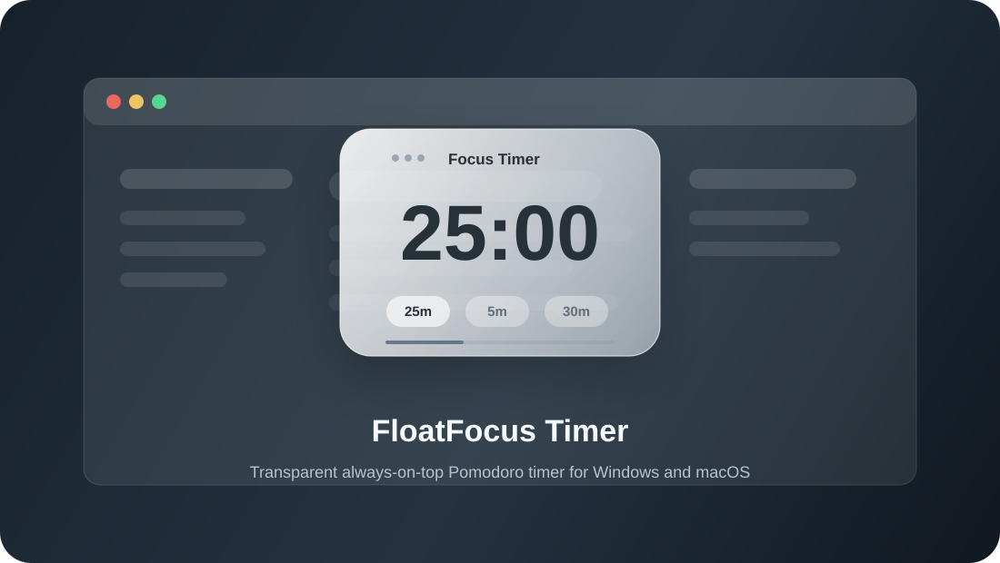

# FloatFocus Timer

一个悬浮在桌面上的透明专注计时器。适合写作、看课件、刷文档、写代码时放在屏幕角落，既能一直看到剩余时间，又不会挡住正在看的内容。



## 功能亮点

- 悬浮置顶：始终显示在其他窗口上方。
- 透明背景：右键菜单可调 `20% / 40% / 60% / 80% / 100%`。
- 番茄钟循环：`25 -> 5 -> 25 -> 5 -> 25 -> 5 -> 25 -> 30`，每段结束后停住，需要手动点开始。
- 点击穿透：开启后鼠标可以直接操作计时器后面的窗口。
- 快捷操作：双击时间开始/暂停，拖动窗口任意移动。
- 桌面快捷方式：Windows / macOS 用户都可以创建桌面启动入口，双击启动。

## macOS 用户怎么使用

### 方法一：使用安装包

如果仓库右侧 `Releases` 有 macOS 安装包，下载对应芯片的文件：

- Apple Silicon：`FloatFocus Timer-...-mac-arm64.dmg`
- Intel Mac：`FloatFocus Timer-...-mac-x64.dmg`

打开 `.dmg` 后，把 `FloatFocus Timer.app` 拖到 `Applications`。如果第一次启动时 macOS 提示“无法验证开发者”，右键点击应用，选择“打开”。未签名版本可能需要在终端执行：

```bash
xattr -dr com.apple.quarantine "/Applications/FloatFocus Timer.app"
```

### 方法二：下载源码后创建桌面启动脚本

1. 点击 GitHub 页面右上角的 `Code`。
2. 选择 `Download ZIP`。
3. 解压到你想保存的位置。
4. 双击运行：

```text
Install-FloatFocusTimer.command
```

如果 Finder 提示脚本没有执行权限，先在终端执行：

```bash
chmod +x Install-FloatFocusTimer.command tools/Install-FloatFocusTimer.command
```

脚本会自动安装依赖，并在桌面创建：

```text
FloatFocus Timer.command
```

以后直接双击桌面的 `FloatFocus Timer.command` 即可使用。

如果脚本提示找不到 `node` 或 `npm`，先安装 Node.js LTS：
https://nodejs.org/

## Windows 用户怎么使用

### 方法一：下载源码后创建桌面快捷方式

1. 点击 GitHub 页面右上角的 `Code`。
2. 选择 `Download ZIP`。
3. 解压到你想保存的位置。
4. 双击运行：

```text
Install-FloatFocusTimer.cmd
```

脚本会自动安装依赖，并在桌面创建：

```text
FloatFocus Timer
```

以后直接双击桌面图标即可使用。

如果脚本提示找不到 `node` 或 `npm`，先安装 Node.js LTS：  
https://nodejs.org/

### 方法二：使用安装包

如果仓库右侧 `Releases` 有 Windows 安装包，下载 `FloatFocus Timer Setup ...exe` 后安装即可。安装器会自动创建桌面快捷方式。

## 开发者运行

```powershell
git clone https://github.com/xiangyuan241-ai/floatfocus-timer.git
cd floatfocus-timer
npm install
npm start
```

## 打包 Windows 安装包

```powershell
npm run build:win
```

打包结果会生成在 `dist` 目录。Windows 安装器会自动创建桌面快捷方式和开始菜单快捷方式。

## 打包 macOS 安装包

macOS 安装包必须在 macOS 上打包。Windows 电脑上执行 `npm run build:mac` 会失败，这是 electron-builder 的平台限制。

```bash
npm ci
npm run build:mac
```

打包结果会生成在 `dist` 目录，包括 `.dmg` 和 `.zip`，并分别输出 `x64` / `arm64` 架构。

## 自动构建 Windows / macOS

仓库包含 GitHub Actions 工作流：`.github/workflows/build-desktop.yml`。

- 手动运行 `Build Desktop Apps` 可以同时生成 Windows 和 macOS 构建产物。
- 推送 `v*` 标签，例如 `v0.1.0`，会触发自动构建并把安装包上传到 GitHub Release。
- macOS 构建会在 GitHub 的 `macos-latest` runner 上执行，避免 Windows 本机无法打 mac 包的问题。

## 使用方式

- 双击时间：开始 / 暂停
- 按住计时器的非按钮区域拖动：移动到任意位置
- `Ctrl+Alt+方向键`：用键盘微调位置
- 鼠标移入：显示开始、重置、点击穿透、更多按钮
- 鼠标移出：隐藏按钮，只保留倒计时
- 右键：选择时间、设置背景透明度、切换点击穿透、退出
- Windows 使用 `Ctrl+Shift+T` 切换点击穿透；macOS 使用 `Command+Shift+T`。

点击穿透开启后，主体区域的鼠标点击会穿过计时器，直接操作后面的窗口。需要再次操作计时器时，把鼠标移到右上角图钉或设置按钮区域，点击图钉关闭穿透；也可以按 `Ctrl+Shift+T` 切换。

## 项目结构

```text
electron/
  Install-FloatFocusTimer.command     macOS 双击安装入口
  main.js                         Electron 主进程，负责窗口、菜单、快捷键
  preload.js                      主进程和页面之间的安全桥接
  renderer/
    index.html                    计时器界面结构
    style.css                     透明玻璃外观
    script.js                     计时器和番茄钟逻辑
  assets/
    FloatFocusTimer.ico           应用图标
    readme-preview.svg            README 预览图
  tools/
    Install-FloatFocusTimer.command  macOS 安装依赖并创建桌面启动脚本
    Install-FloatFocusTimer.ps1   安装依赖并创建桌面快捷方式
    Create-DesktopShortcut.ps1    创建桌面快捷方式
    Start-FloatFocusTimer.vbs     隐藏命令行窗口启动应用
  .github/workflows/
    build-desktop.yml             在 Windows / macOS runner 上生成安装包
```

## 关键实现

- `BrowserWindow` 使用 `transparent: true`、`frame: false`、`alwaysOnTop: true` 实现透明无边框置顶窗口。
- `win.setIgnoreMouseEvents(true, { forward: true })` 实现点击穿透，并让右上角控制区可以临时解锁。
- `globalShortcut` 在 Windows 注册 `Ctrl+Shift+T`，在 macOS 注册 `Command+Shift+T` 作为全局穿透开关。
- renderer 通过 IPC 手动拖动窗口，避免 Electron 拖拽区域吞掉双击事件。
- 背景透明度通过 CSS 变量调整，文字保持清晰。
